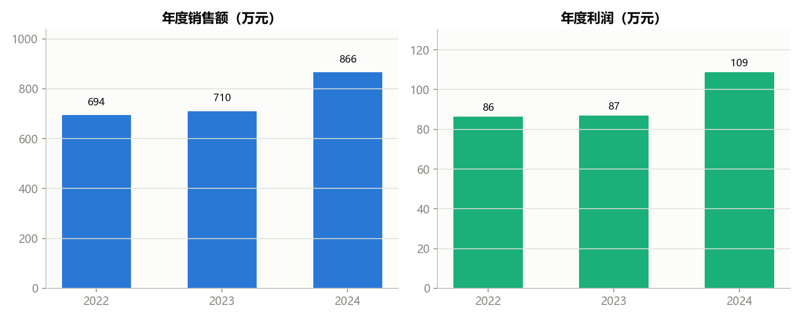
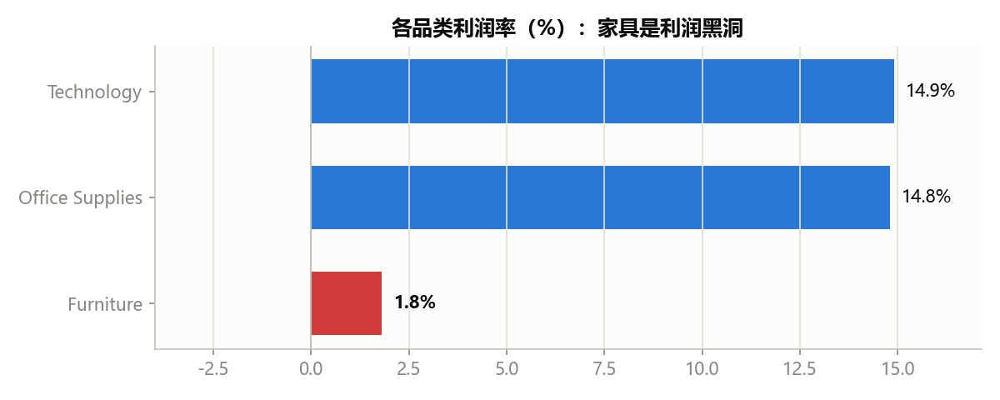
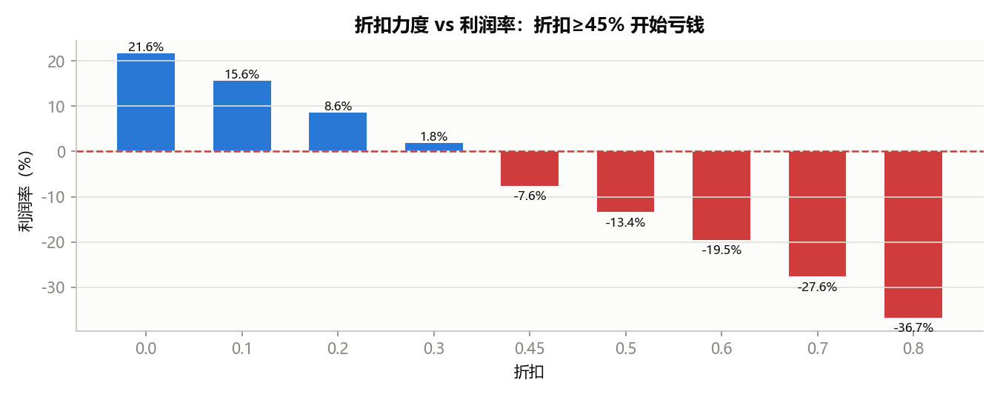
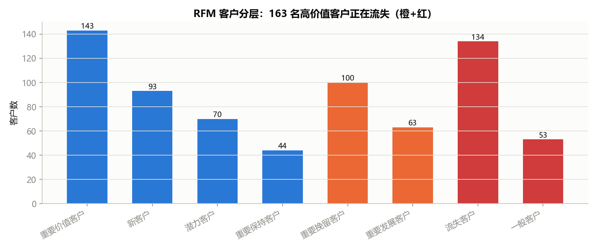

# 零售企业经营数据分析报告
---

## 一、项目概述

| 项目 | 说明 |
|---|---|
| 数据 | 模拟零售订单 9005 行 × 21 字段（2022–2024，结构与 Tableau Sample Superstore 一致） |
| 工具 | MySQL 8.0（存储 + SQL 分析）、Python（pandas / numpy / matplotlib，RFM 分层 + 可视化） |
| 方法 | 五问递进：整体健康度 → 利润黑洞 → 折扣侵蚀 → 客户分层 → 增长机会 |

---

## 二、核心结论

1. **公司整体健康**：3 年销售额 2270 万，利润率 12.4%，逐年增长，Q4 为旺季。
2. **利润黑洞在家具**：家具品类利润率仅 1.8%，其中「桌子（Tables）」子品类亏 4.3 万（−2.2%）。
3. **根因是深折扣**：折扣 ≥45% 的订单全部亏损，折扣越深亏得越狠。
4. **高价值客户在流失**：163 名平均消费 5 万+ 的客户已 85 天以上未下单。

---

## 三、分析发现（SQL 部分）

### 发现 1：整体健康、逐年增长、Q4 旺季

- 销售额从 2022 年 694 万增长到 2024 年 866 万，利润同步增长（86 万 → 109 万）。
- 月份环比显示 **Q4（10–12 月）连续冲高**（+20%~40%），**1 月规律暴跌**（−29%，两年一致）。

### 发现 2：家具是利润黑洞，桌子在亏钱

| 品类 | 销售额 | 利润 | 利润率 |
|---|---|---:|---:|
| Technology | 1673 万 | 250 万 | 14.9% |
| Office Supplies | 164 万 | 24 万 | 14.8% |
| **Furniture** | **433 万** | **7.6 万** | **1.8%** |

下钻到子品类：**Tables 亏 4.3 万（−2.2%）**，Furnishings（0.9%）、Chairs（4.6%）也利润微薄——整个家具品类基本不赚钱。

### 发现 3：折扣 ≥45% 即亏损（利润悬崖）

- 不打折订单利润率 21.6%；20% 折扣降至 8.6%；**45% 折扣开始亏 −7.6%，80% 折扣亏 −36.7%**。
- 结论：家具正是靠深折扣清库存，才把利润打穿。

---

## 四、客户分层（Python RFM）

对每个客户计算 **R**（最近一次购买距今）、**F**（下单次数）、**M**（累计消费），按中位数分高/低，组合成 8 类：

| 客户分层 | 客户数 | 平均消费 | 平均下单次数 | 距今天数 |
|---|--:|--:|--:|--:|
| 重要价值客户 | 143 | 50,077 | 16 | 14 |
| 新客户 | 93 | 12,508 | 10 | 16 |
| 潜力客户 | 70 | 17,470 | 15 | 14 |
| 重要保持客户 | 44 | 47,038 | 11 | 14 |
| **重要挽留客户** | **100** | **53,268** | 16 | **85** |
| **重要发展客户** | 63 | 49,508 | 10 | **103** |
| 流失客户 | 134 | 12,293 | 10 | 120 |
| 一般客户 | 53 | 18,503 | 15 | 90 |

这里最值得注意：「重要挽留客户 + 重要发展客户」一共 163 人，平均消费 5 万+（比现在还活跃的金主都高），却已经 85–103 天没下过单——**最值钱的客户正在流失**。另外，沉睡客户（≥85 天没消费）加起来 287 人，占全部客户的 41%。

---

## 五、商业建议

### 建议一（优先级：高）｜挽留流失的高价值客户
拉出 163 名沉睡高价值客户名单，发"老客回归"专属优惠券、做一对一触达。挽回 10% 即可带来约 80 万销售额，成本远低于拉新。

### 建议二（优先级：高）｜给家具折扣设红线，堵住利润黑洞
折扣上限 ≤40%，停止深折清库存；改"打折"为"桌子+椅子捆绑销售"；清库存放到 1 月淡季做，不在 Q4 旺季打折。

### 建议三（优先级：中）｜旺季备货、淡季促销
Q4 前（9 月）提前备货，旺季不打深折；1 月淡季集中促销 + 消化家具库存。

### 建议四（优先级：低）｜潜力客户提客单、新客户养复购
潜力客户（买得勤但客单价低）推"加购/升级套餐"；新客户首单后 7 天内二次触达，培养复购。

总结一下：先把流失的金主捞回来，比花钱拉新划算；同时把家具那种亏本折扣停掉。

---

## 六、技术栈与方法

- **SQL**：`GROUP BY` / `HAVING`、`DATE_FORMAT` / `YEAR`、窗口函数 `RANK() OVER`、`LAG()`（环比）、子查询。
- **Python**：`pymysql` 连接 MySQL、`pandas` 聚合、`numpy` 打分、RFM 三分位分层、`matplotlib` 可视化。
- **数据质量**：数据生成时注入 5 类问题（空邮编/重复行/日期倒挂/负数量/离群值），作为清洗练习。

---

## 附：项目文件

| 文件 | 说明 |
|---|---|
| `mysql_setup.sql` | 建库建表 |
| `queries_mysql.sql` | SQL 分析脚本（5 个业务问题） |
| `rfm_analysis.py` | Python RFM 分层 + 可视化 |
| `图1~4_*.png` | 报告图表 |
| `RFM客户分层结果.xlsx` | RFM 明细 + 分层汇总 |
